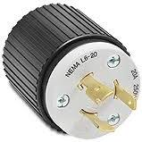
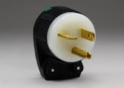

# How to Install a Mass Spectrometer

Mass spectrometry is a wonderful technology.  It will empower your science.  If you are a scientist or researcher that is responsible for overseeing for the first time an installation of a new MS system in your lab, this document is for you.  It distills our hard-won knowledge gleaned from failures and difficulties -- and eventual successes -- encountered in installing two research-grade LC-MS systems in 2016 and 2017.

## Site selection

Commercially available mass spectrometers are big and bulky (there are some [new exceptions](http://908devices.com/products/g908/) to this rule).  They have complex electrical, gas exhaust, and gas supply requirements.  Figuring out where to put them is your first challenge. 

1. *Is there enough room for the chosen instrument in the planned location?*
  Vendors specify the size of their instruments in a "Site Preparation Guide", a "Site Preparation Checklist", a "Preinstallation Guide", or a similar document.  **These documents from vendors are not always accurate or up-to-date.**  Also, neither mass spectrometers nor open most bench spaces are perfect rectangular prisms.  "Height", "width", and "depth" specifications are enough to get you started, but are not sufficient to fully describe the space you will need.
  **Always to try to visit an installed instrument of the type you plan to buy and measure it carefully.  Take photographs.**

2. *Is the chosen space accessible from both the front and the rear?*
  Installation and servicing will be much easier if the instrument can be accessed from both sides and if the bench where it sits is open underneath.  **Ideally, the mass spectrometer will not be installed right against a wall or other fixed vertical barrier.  Additionally, the ideal site does not have any fixed (built-in) furniture such as drawers or cabinets underneath the instrument.**  Instead, there is empty space between the tabletop where the instrument will sit and the floor.  
  * Routing the rough pump exhaust line and the LC waste lines is easier with space behind and below the instrument.  Otherwise, holes must be drilled through a lab bench -- or lines must wrap around the front of a bench, where people are likely to accidentally get entangled with them.
  * Service often requires accessing all sides of the LC-MS to change acquisition boards, smart cards, etc.  The field-service engineers aren't always able to physically climb on top of a bench and twist or bend themselves into the positions required to do this when the back of the instrument is blocked by a wall.
  * Having empty space underneath the mass spectrometer tabletop provides maximum flexibility.  With open space, its easy to add sound enclosures for the rough pumps, or separate movable drawers or cabinets as needed.
  

3. Does your site meet electrical requirements?  
  Mass spectrometers often require high-voltage power in addition to the standard 110V AC circuits present in the USA.  Instrument vendors often provide site installation (click [here](http://cn.agilent.com/cs/library/sitepreparationchecklists/G6400_LCMS_Site_Preparation_Checklist.pdf) for an example) that list some of these requirements.  **Vendor site preparation checklists are incomplete and do not list all the information that you must know to install an instrument.**  High-voltage circuits must meet the voltage, amperage, and [phase](https://en.wikipedia.org/wiki/Three-phase_electric_power) requirements of the vendor.  However, electrical outlet plug types vary dramatically.  There are [NEMA L6](https://www.google.com/search?site=&tbm=isch&source=hp&biw=1276&bih=636&q=%22NEMA%20L6%22) plugs, there are [NEMA 6-15p](https://www.google.com/search?site=&tbm=isch&source=hp&biw=1276&bih=636&q=%22NEMA%206-15p%22) plugs, and there are [NEMA 6-20p](https://www.google.com/search?site= "NEMA 6-20p") plugs.  And that's just to name a few, [there are many more](https://en.wikipedia.org/wiki/NEMA_connector) -- and that's just for the USA. [Here](images/NEMA_charts.pdf) is a chart of many [NEMA](http://www.nema.org/pages/default.aspx)-format outlets for your browsing pleasure.
  **Vendor site preparation guides do not always specify what plug types you need**.  Check carefully with your sales representatives, installation engineers, and logistics coordinators from your vendor.  Take photographs of a recently-installed version of your instrument if possible.
  _The ideal location for electrical outlets is *from above*, i.e. outlets that are ceiling mounted are the best._
  

  
4. Does your site supply appropriate gases and provide appropriate exhaust?
  * Gas supply.  Most mass spectrometers usually require gases to operate.  Some instruments require one gas for the ion source, and another for the collision cells.  Gas requirements *are* usually well-specified in vendor site preparation guides.  However, the exact ways in which gas will be plumbed to the instrument is often _not_ specified.  What sized tubing will be required to feed gas to the instrument?  Does the tubing need to be copper?  Or are other materials OK?  Will the vendors be providing in-line filters for gas cleanup between the source and the instrument?  What fittings will be needed for each stage in the gas line process?  How close is your nearest [Swagelok](https://www.swagelok.com/en) distributor?  These are questions that should be answered before engineers come to install your instrument.
  * Exhaust requirements.  Most of the time, ventilation will be to a fume hood or dedicated exhaust manifold.  This is often correctly specified in user preparation guides or checklists.
  
## Instrument identification

The best instrument to buy depends on (a) your science, and (b) your budget.  This document isn't about either topic.  You should talk to scientists who bought the instrument you are planning to buy and make sure it will do the job you need.

## Site preparation procedure

1. Thoroughly familiarize yourself with required modifications to the site.
	1. Thoroughly read the vendor's site preparation guide.  
	2. Confirm with *all* of (a) the vendor sales rep, (b) the vendor logistics coordinator, and (c) the field service engineer about additional / modified requirements for installation.  Ask each party for :
		1. The type of power outlets required
		2. The type of gas lines (e.g. NPT or Swagelok, diameter, tubing type) that will be used to connect the instrument
		3. The exact specification of fittings required for installation of the specified gas lines
		4. The exhaust tubing requirements
		5. Fittings required for using vendor-specified exhaust tubing
		6. Ethernet jacks required for interfacing LC-MS computers to the internet
2. Learn who at your institution is responsible for contracting electrical and gas line work.  This could be a building manager, a construction manager, an associate dean, a PI, or someone else.  In some cases it even be you.  (In this document we assume that you can avoid this last, somewhat nightmarish scenario.)  This person will be your contracting POC.
3. Learn who at your institution controls the space you will be modifying for installation.
  * Space at universities can be controlled by single (or multiple) individual PIs, by committees, by deans, or by mixtures of the three.  
  * It is vital to obtain the approval and understanding of *all* parties that must agree to or approve site modification.
  * At universities, understanding formal lines of authority is necessary but not sufficient for identifying whose approval and understanding you will need.  Collegiality dictates that you may need to seek approval and understanding for your site modifications from many parties.
	
4. Ask your contrating POC to obtain quotes for all required site modifications.  **Stipulate clearly, firmly, repeatedly, and in writing that you are interested in quotes only, and are _not_ seeking to schedule any work.  Require that quotes be in writing and contain detailed work descriptions.**  In fact, it is best to obtain quotes for site modifications _before_ you even purchase your instrument.  Your instrument vendor's sales reps can better assist you with their own firms' installation and logistics teams if you ask for confirmation of site installation requirements _before_ purchase.
5. After quotes have been obtained, prepare a statement of work that summarizes the planned work, includes all obtained written quotes, and also has photographs of areas to be modified to all parties that control or use the space for your install site.  Meet personally with every key stakeholder to make sure they (a) understand and (b) approve of the modifications you want to make.  Emphasize that your statement of work is *not* a schedule.
6. After all stakeholders have signed off on your plans, schedule the work.
	1. Propose a schedule in Gantt-chart format and share it with (a) your contracting POC, (b) lab space stakeholders, and (c) sales reps and/or installation engineers from your MS vendor.  Let each party offer feedback.  Modify the schedule accordingly.  Repeat step 1 until all parties agree with your schedule.
		* The schedule should include a step (with a deadline) for all parties to approve the schedule.
		* Remember to include contacting campus IT services to activate ethernet ports, if required.
	3. After all parties agree on a schedule, purchase the mass spectrometer.
	4. Ask your contracting POC to initiate the quoted work for site modification.
	5. After site modification is completed, take pictures of all new electrical outlets, exhaust vents, nitrogen (or other) gas lines, and send them to the vendor installation engineer.  Ask them to confirm that the installed hardware meets their requirements.
	6. Ask again what the field service engineer will need for the installation.  You may be surprised to find that contrary to any document or testimony you've heard to date, that you will be expected to provide a few hundred mL of LC-MS grade isopropanol, or will need to buy your own special calibration mix, or that the installation engineer expectes to be able to use your beakers, sonicators, etc. for cleaning parts.  Or that you'll be expected to supply several burly indidviduals to help lift things at key moments.  Order any needed supplies, or tell the vendor that you won't be able to provide it.  Do this before the scheduled date of installation.
  
## During installation
1. Get to know and be kind to your installation engineer.  They know more than you about mass spectrometry hardware, and this is a prime chance to learn from them.
2. Ask before any work begins what goals and end points the installation engineer has.
	* These should include "familiarization" or "training" of you or other users.  Ask detailed questions and make specific requests about what areas of the MS and its use that you would most like familiarization on.
3. Take lots of pictures during the install.  Ideally, you won't be seeing the inside of the mass spectrometer again after install for a long while.
4. When (and "when" is probably a better word to use than "if") the installation engineer notifies you of a delay, missing parts, or other problems, write an email to document the problem and send it to the vendor logistics coordinator or sales rep.
6. You are soon going to have to dispose of a lot of waste, including palets left over from instrument shipping, lots of cardboard (potentially recyclable depending on your institution), and lots of packing materials.  Locate the closest dumpster, recycling area, hoppers, dollies, hand trucks, and other tools and facilities to make this waste disposal easy.
5. When the installation is complete, be sure to congratulate your installation engineer on a job well done.  Most installation engineers are also field service engineers; you may see them again if your instrument breaks and you hire the vendor to repair it (or if you have a service agreement).
  
## After installation
1. As soon as possible after installation, prepare clean samples of authentic standards and analyze them on the instrument.  Verify that everything works. 
2. If something doesn't work, contact your installation engineer and/or vendor as soon as possible.
  
  